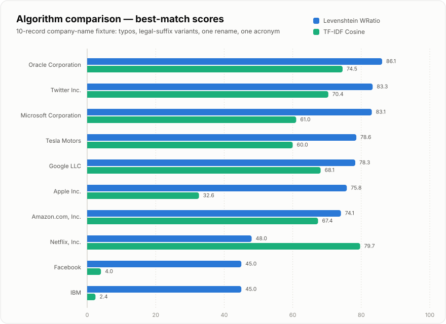

# fuzz-match

Fuzzy record-matching engine with two algorithms: TF-IDF cosine similarity (fast on large datasets) and Levenshtein WRatio (accurate on short strings).

[](LICENSE)
[](.python-version)



## Overview

Matches records by similarity and scores them on a 0–100 scale. Input: CSV with one or two columns. Output: CSV with name, matched name, and score. Two algorithms provide speed/accuracy tradeoffs: TF-IDF with sparse matrix multiplication runs fast on 1000+ records; Levenshtein WRatio excels on short strings and handles typos. Both normalize text, handle Unicode, and estimate runtime before execution.

## Key Results

Tested on a 10-record company-name fixture with intentional typos, legal-suffix variants, one rename (Facebook → Meta Platforms), and one acronym expansion (IBM):

| Algorithm | High Match | Low Match | Avg Score |
|-----------|-----------|-----------|-----------|
| Levenshtein WRatio | Oracle (86.1) | Facebook / IBM (45.0) | 69.7 |
| TF-IDF Cosine | Netflix (79.7) | IBM (2.4) | 52.0 |

WRatio trades sensitivity for accuracy on short text; cosine favors precision on longer, less-standardized strings — and handles case differences better (Netflix vs. NETFLIX INTL), while both collapse on renames and acronym expansions that share no surface text.

Regenerate the chart and scores: `uv run python scripts/generate_comparison_chart.py`

## How It Works

**Levenshtein WRatio:** Calculates weighted edit-distance ratio. Fast for small datasets, excels on human-readable names and short fields.

**TF-IDF Cosine:** Vectorizes strings as character bigram/trigram TF-IDF, computes cosine similarity, returns top-N matches per input. Uses sparse matrix multiplication for performance on large datasets.

## Quickstart

```bash
git clone https://github.com/uehlingeric/fuzz-match.git
cd fuzz-match
uv sync
```

Create `input/records.csv` with one of these formats:

```csv
# Self-match (single column)
to_match
Apple Inc
Appel
```

```csv
# Cross-match (two columns)
to_match,to_match_to
Apple Inc,Apple Computer
Microsoft,Microsft
```

```bash
uv run fuzz-match --rf   # Levenshtein WRatio
# or
uv run fuzz-match --mc   # TF-IDF cosine
```

Results appear in `output/records.csv` with columns: `name`, `matched_name`, `score`.

## Usage

### Command Line

```bash
# Pre-match time estimate + run
uv run fuzz-match --rf

# or for TF-IDF (faster on 1000+ records)
uv run fuzz-match --mc
```

Input CSV must have exactly one file in `input/`; output overwrites and removes input.

### Python API

```python
from fuzz_match import matrix_cosine, rapid_fuzz_wratio

to_match = ["Apple Inc.", "Microsoft"]
to_match_to = ["Apple Computers", "Microsft Corp"]

# WRatio
result = rapid_fuzz_wratio(to_match, to_match_to)
print(result)

# TF-IDF cosine
result = matrix_cosine(to_match, to_match_to, topn=1)
print(result)
```

## Project Structure

```
fuzz-match/
├── src/fuzz_match/       # Core matching algorithms
│   ├── core.py           # matrix_cosine, rapid_fuzz_wratio
│   └── cli.py            # Command-line interface
├── tests/                # Unit tests
├── pyproject.toml        # uv-managed dependencies
├── Makefile              # setup, test, lint, format, run, clean
├── data/README.md        # Input/output CSV format documentation
└── docs/assets/          # Charts and diagrams
```

## Limitations

- Single file per run (CLI mode) — batch processing requires scripting
- WRatio is O(n²) on dataset size; scales to ~100k pairs on modern hardware
- TF-IDF vectorizer loads all strings into memory; datasets > 1M records need partitioning
- No incremental index updates — full re-vectorization on new data

## Development

```bash
make setup       # uv sync
make test        # pytest with coverage
make lint        # ruff check
make format      # ruff format
make clean       # remove cache/build artifacts
```

## License

MIT © Eric Uehling.
